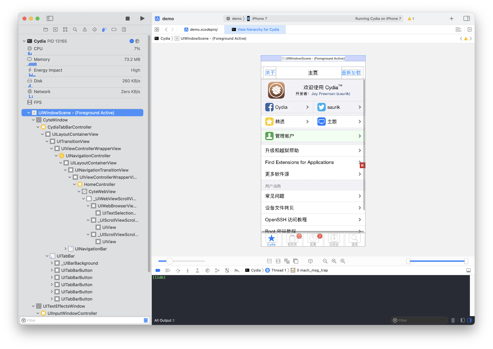
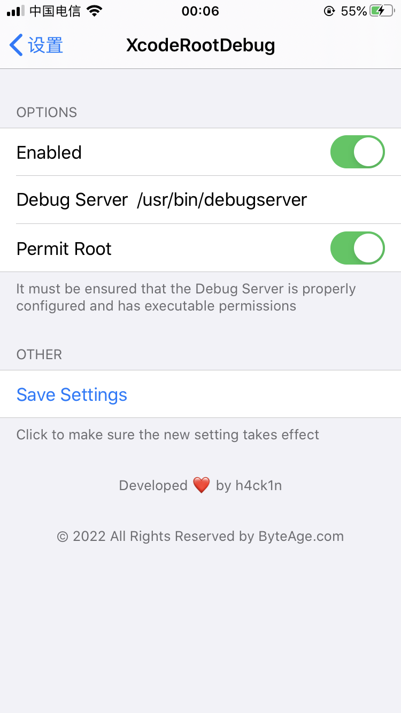

# XcodeRootDebug

[中文](https://github.com/lemon4ex/XcodeRootDebug/blob/main/README_CN.md)

Allow `xcode` to start a custom `debugserver` with `root` privileges to debug iOS apps.

Currently only tested on the following jailbroken devices:

* iPhone 6s 14.2
* iPhone 7 13.6.1
* iPhone 7 15.6.1
* iPhone X 16.6.1
* iPhone 11 Pro 14.2

Theoretically supports iOS10 and above devices, including A12.

Repo：https://repo.byteage.com

# How to use
## Install
1. Add the source `https://repo.byteage.com` and install it directly
2. Download the source code, compile and install

## Configuration
1. According to the device system version, find the corresponding dmg file in `Xcode`, such as `/Applications/Xcode.app/Contents/Developer/Platforms/iPhoneOS.platform/DeviceSupport/14.3/DeveloperDiskImage.dmg`
2. Double-click the dmg to mount and copy `/Volumes/DeveloperDiskImage/usr/bin/debugserver` to `~/Desktop/debugserver`
3. Copy the following content and save it to `~/Desktop/debugserver.entitlements`
```xml
<?xml version="1.0" encoding="UTF-8"?>
<!DOCTYPE plist PUBLIC "-//Apple//DTD PLIST 1.0//EN" "http://www.apple.com/DTDs/PropertyList-1.0.dtd">
<plist version="1.0">
<dict>
	<key>com.apple.springboard.debugapplications</key>
	<true/>
	<key>com.apple.backboardd.launchapplications</key>
	<true/>
	<key>com.apple.backboardd.debugapplications</key>
	<true/>
	<key>com.apple.frontboard.launchapplications</key>
	<true/>
	<key>com.apple.frontboard.debugapplications</key>
	<true/>
	<key>com.apple.private.logging.diagnostic</key>
	<true/>
	<key>com.apple.security.network.server</key>
	<true/>
	<key>com.apple.security.network.client</key>
	<true/>
	<key>com.apple.private.memorystatus</key>
	<true/>
	<key>com.apple.private.cs.debugger</key>
	<true/>
	<key>com.apple.private.thread-set-state</key>
	<true/>
	<key>com.apple.private.security.no-container</key>
	<true/>
	<key>com.apple.private.skip-library-validation</key>
	<true/>
	<key>com.apple.system-task-ports</key>
	<true/>
	<key>get-task-allow</key>
	<true/>
	<key>platform-application</key>
	<true/>
	<key>run-unsigned-code</key>
	<true/>
	<key>task_for_pid-allow</key>
	<true/>
</dict>
</plist>
```
4. Use `ldid` to sign new permissions on `debugserver`
```shell
cd ~/Desktop
ldid -Sdebugserver.entitlements debugserver
```
5. Copy the signed `debugserver` to the `/usr/bin/debugserver` path of the jailbroken device, and use the root user to give it executable permissions
```shell
chmod +x /usr/bin/debugserver
```
6. Execute `debugserver` to ensure normal operation
```shell
iPhone-X:~ root# debugserver
debugserver-@(#)PROGRAM:LLDB PROJECT:lldb-1403.2.3.13
 for arm64.
Usage:
  debugserver host:port [program-name program-arg1 program-arg2 ...]
  debugserver /path/file [program-name program-arg1 program-arg2 ...]
  debugserver host:port --attach=<pid>
  debugserver /path/file --attach=<pid>
  debugserver host:port --attach=<process_name>
  debugserver /path/file --attach=<process_name>
```
7. Restart `lockdownd` on jailbroken device
```shell
killall lockdownd
```
8. Connect the jailbroken device to the computer, open `Xcode`, and use the menu `Debug->Attach to Process by PID or Name...` or `Debug->Attach to Process` to attach to any process you want to debug.

## Known issues
* If you use [Palera1n](https://palera.in/) jailbroken device, you must install the `ldid` from the official source `palera1n strap`, and then copy `debugserver.entitlements` and `debugserver` to the jailbroken device , and execute the `ldid -Sdebugserver.entitlements debugserver` command on the jailbroken device, otherwise `debugserver` cannot be started. The `ldid` of the official source has been modified. Only by using it to sign the executable program can the command line tool be executed normally, otherwise an error will be reported.

# Background

Usually, when we use `xcode` for real machine debugging, there are the following limitations:

1. The debugger can only be started with `mobile` permissions
2. The debugger that can be started can only be `/Developer/usr/bin/debugserver`

Based on the above limitations, the following problems arise:

1. Unable to debug system processes, such as: `Cydia`、`Safiri`
2. Unable to debug the app downloaded from `AppStore`, the app needs to be re-signed after smashing the shell

To solve the above problems, you need to use `debugserver` with high permissions. For the specific configuration process, you can refer to the article [Tips and Problem Handling for Configuring DebugServer + lldb Debugging Environment under iOS12](https://iosre.com/t/ios12-debugserver-lldb/14429).

To solve the above limitations, you need to install this tweak.

After installing this tweak, it will allow developers to use `xcode` to start a custom `debugserver` with `root` privileges for debugging.

You can set the tweak in settings。

# Article

You can read [this post](https://byteage.com/154.html?from=github) to get some information.

# ScreenShots



